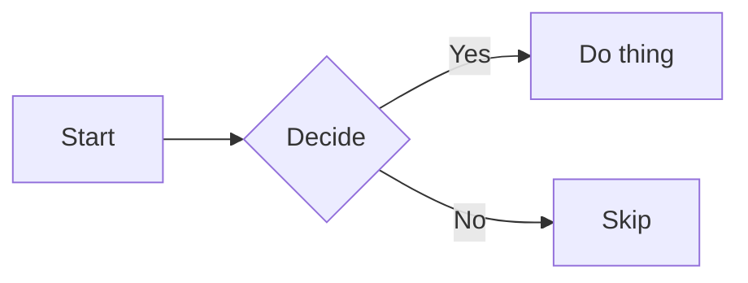
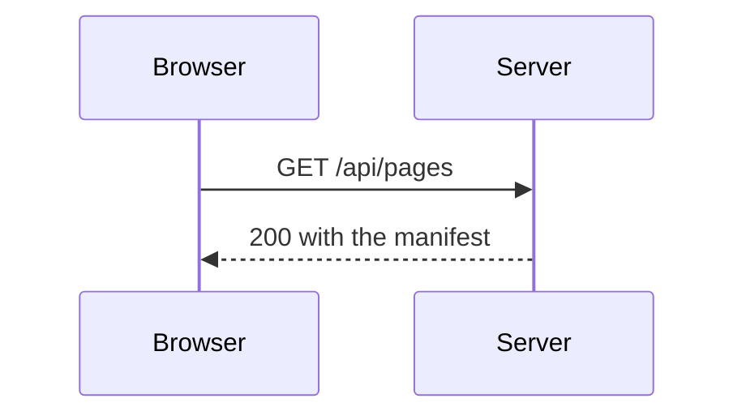
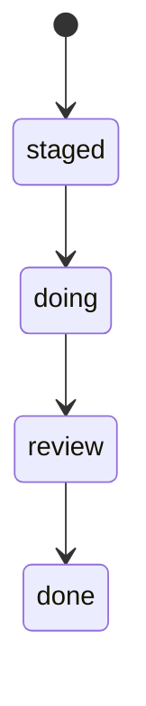
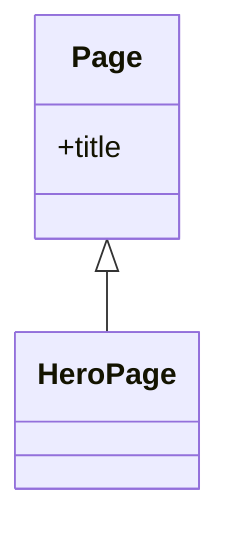

Diagrams help to communicate complex relationships and interconnections between different technical components, and are a great addition to project documentation. nimpress integrates with Mermaid.js, a very popular and flexible solution for drawing diagrams, loaded only on the pages that carry one.

## Configuration

A ` ```mermaid ` fence is all a diagram needs. The plugin rewrites the fence to a placeholder at build time, and the page mounts the renderer over it in the browser, so a page without a diagram never downloads mermaid. The renderer follows the theme toggle and re draws in the other palette.

## Usage

### Use flowcharts

Flowcharts are diagrams that represent workflows or processes. The steps are rendered as nodes of various kinds and are connected by edges, describing the necessary order of steps:

````md

````

### Use sequence diagrams

Sequence diagrams describe a specific scenario as sequential interactions between multiple objects or actors, including the messages that are exchanged between those actors:

````md

````

### Use state diagrams

State diagrams are a great tool to describe the behavior of a system, decomposing it into a finite number of states, and transitions between those states:

````md

````

### Use class diagrams

Class diagrams are central to object oriented programming, describing the structure of a system by modelling entities as classes and relationships between them:

````md

````

### Use entity-relationship diagrams

An entity-relationship diagram is composed of entity types and specifies relationships that exist between entities. Reach for a [DBML page](/authoring/dbml) instead whenever the subject is a real database schema; it renders an interactive canvas with every column clickable.

### Other diagram types

Besides the diagram types listed above, Mermaid.js provides support for pie charts, gantt charts, user journeys, git graphs, and mindmaps, all of which render through the same fence.

See [Mermaid diagrams](/examples/mermaid) for every kind rendered.
