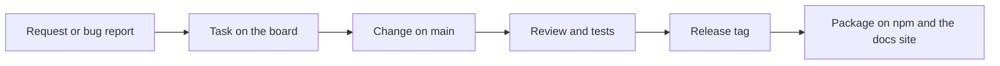

We build software with and for our users, shaping strategy, design, and implementation through continuous collaboration. The aim is to ensure that the product vision and the roadmap are always aligned with the needs of the people who write documentation with nimpress.

## Process overview

The diagram below outlines the stages a change goes through and the points at which a user can take part.

## Process steps

1. A user reports a bug or requests a change, with the reproduction or the use case that makes it concrete.

2. The maintainers board it as a task with its intent, its scope, and the command that proves it done.

3. The change lands on `main` with its docs page and its changelog section in the same commit, and its browser spec beside the others.

4. Review reconciles the diff against the task, and the test suite proves it in a real browser against the built site.

5. A version tag publishes the package to npm and this site to GitHub Pages in one workflow.

## Benefits

### Transparency

Every change has a changelog entry the reader can find by version, and every rule the code follows is a file under `.claude/rules` that ships inside the package.

### Alignment of interests

The docs site you read is built with nimpress from the repository's own docs folder, so every feature is exercised by the people who ship it before it reaches you.

### Influence

A bug report with a reproduction and a change request with a use case are the two ways a user changes what ships next. See [Contribute](/community/contribute).
