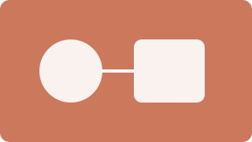

Every inline formatting form and every image form nimpress renders, each followed by its source.

## Highlight text

Text can be ==highlighted== with two equals signs, ^^inserted^^ with two carets, and ~~deleted~~ with two tildes.

```md
Text can be ==highlighted== with two equals signs, ^^inserted^^ with two carets, and ~~deleted~~ with two tildes.
```

## Sub- and superscripts

H~2~O is water and E = mc^2^ is energy.

```md
H~2~O is water and E = mc^2^ is energy.
```

## Keyboard keys

Press ++ctrl+alt+del++ to restart, ++cmd+k++ to search, and ++enter++ to confirm.

```md
Press ++ctrl+alt+del++ to restart, ++cmd+k++ to search, and ++enter++ to confirm.
```

## Image alignment

{align=right}

The image sits beside this paragraph and the ones after it until a heading clears the float. Every paragraph here wraps around the image, so a short illustration reads next to the prose that describes it rather than pushing the prose below it.

```md
{align=right}
```

## Image captions


```md

```

## Light and dark mode


Toggle the theme in the header to swap the image.

```md


```

## Lightbox and zoom

{.zoom}

Click the image to open it full size, then press escape or click outside to close it.

```md
{.zoom}
```

## Tooltips

A link with a title, [the nimpress repository](https://github.com/nimling/nimpress "Opens the repository on GitHub"), a footnote reference[^1], and a page local abbreviation, the W3C, all show a tooltip on hover.

*[W3C]: World Wide Web Consortium

[^1]: Footnotes render at the bottom of the page and as a tooltip on the reference.

```md
A link with a title, [the nimpress repository](https://github.com/nimling/nimpress "Opens the repository on GitHub"), a footnote reference[^1], and a page local abbreviation, the W3C.

*[W3C]: World Wide Web Consortium

[^1]: Footnotes render at the bottom of the page and as a tooltip on the reference.
```
