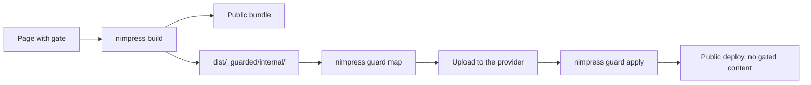

A gated page never reaches the public host. The build separates it into its own bundle, the runtime resolves that bundle from the auth provider, and the provider serves it only to a viewer whose session satisfies the gate.

## The flow



## 1. Mark the page

One field. The value is an arbitrary string that your own code interprets; nimpress gives it no meaning.

```yaml
---
title: Internal runbook
gate: internal
---
```

## 2. Configure the session and the guard

```ts
import { defineConfig } from '@nimtech/nimpress/plugin'

export default defineConfig({
  title: 'Docs',
  auth: {
    authEndpoint: 'https://auth.example.com',
    clientSlug: 'docs',
    guard: (frontmatter) => (frontmatter.gate === 'internal' ? 'staff' : 'public')
  }
})
```

`guard` runs once per gated page at build time and returns the bundle name the page lands in. Without it the gate value is the bundle name. It receives the frontmatter, the file path, and the page's related files, so a component page can be routed by its system as easily as by its gate.

## 3. Decide who may read it

The default checker requires an authenticated viewer for any gated page. Pass your own to interpret the gate however the project needs.

```ts
accessChecker: (viewer, requirement) => {
  if (!viewer) return false
  return viewer.roles?.includes(requirement.gate)
}
```

Sidebar entries the viewer cannot reach disappear, search hits are excluded, and direct navigation redirects to the login flow.

## 4. Build

```bash
pnpm exec nimpress build
```

```
dist/
├── index.html
├── access.json          gate and bundle per route
├── guard.map.json       what went where
└── _guarded/
    └── staff/
        ├── manifest.json
        ├── search.json
        └── body/
            └── internal-runbook.json
```

The gated body never enters the public bundle.

## 5. Describe the artifacts

```bash
pnpm exec nimpress guard map
```

That enriches `guard.map.json` with one entry per guarded file: `sha256`, `size`, `mime`, its bundle, and the gates the bundle serves. Pass `--dist=<dir>` for a build folder other than the configured one and `--out=<path>` to write the map elsewhere.

## 6. Upload and apply

Upload the bundles to the auth provider keyed by that map. The provider returns a mapping json carrying a `base` url where the artifacts now live.

```bash
pnpm exec nimpress guard apply --map=uploaded.json
```

That writes the base into `dist/access.json`, then removes `dist/_guarded/` and `dist/guard.map.json` from the build. What you deploy carries no gated content, and the runtime resolves guarded bundles against the provider.

## Gating is not hiding

`visibility` and `gate` are independent. `visibility: hidden` removes a page from the build entirely and `dev-only` removes it from the built bundle, so a viewer who satisfies the gate still cannot reach a page whose visibility excludes it. Use `gate` for access and `visibility` for drafts.

The login and logout calls, the viewer store, and the provider contract are in [Auth](/auth).
