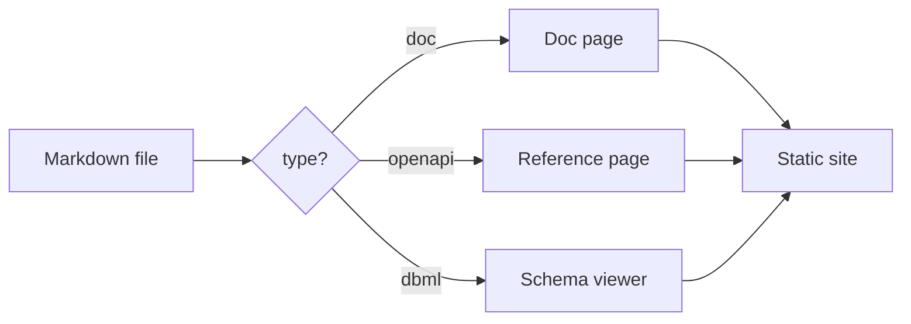
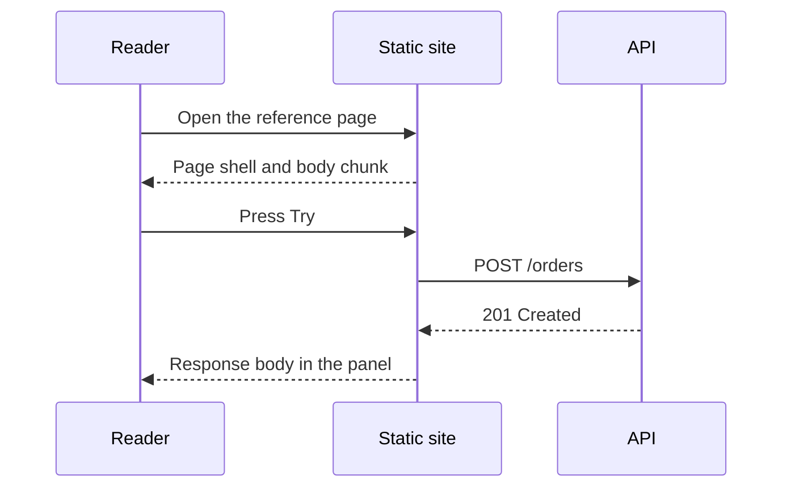
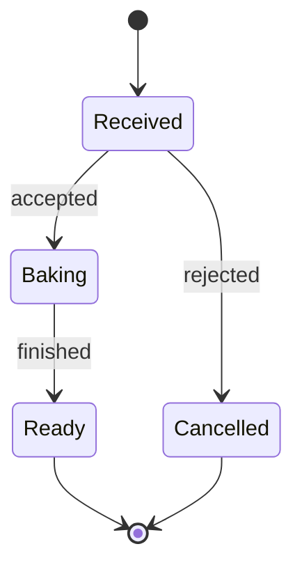
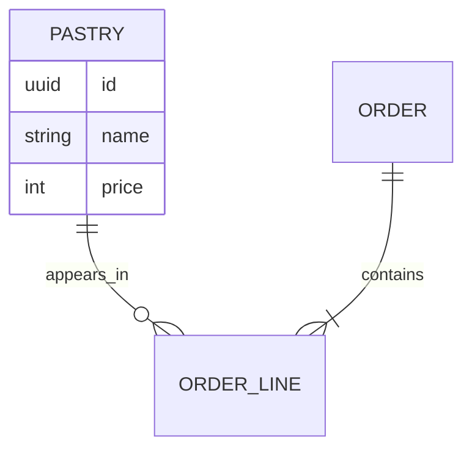

A ` ```mermaid ` fence renders as a diagram. The library loads only on pages that carry one, so a page with no diagram downloads none of it.

## A flowchart



````md

````

## A sequence



## A state machine



## An entity relationship



For a real database rather than a sketch, reach for [DBML](/extensions/dbml) instead. It reads the schema you already maintain and renders columns, keys, and relationships you can click through. The [schema viewer example](/examples/schema-viewer) shows the difference.

## Theming

Diagrams inherit the site theme from `tokens.css` and repaint when the reader switches between light and dark. There is no per diagram color to set.

The supported diagram list and the loading behavior are in [Mermaid](/extensions/mermaid).
