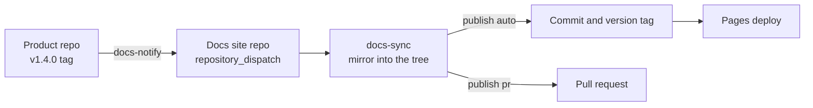

A product repo keeps its documentation beside its code. On a version tag it dispatches the docs site, which mirrors the folder into a mapped subtree and either commits or opens a pull request. This walkthrough builds both sides.

## The shape



## The product repo

### 1. The export folder

Put the pages that should ship into an export folder at the repo root. `.nimpress` is the default and `export-dir` names another.

```
my-product/
├── .nimpress/
│   ├── index.md
│   ├── getting-started.md
│   └── changelog/
│       └── v1.4.0.md
└── .github/workflows/docs.yml
```

`index.md` needs valid frontmatter like any nimpress page:

```md
---
title: My product
description: What this product is, in one sentence.
---

## Overview

Prose.
```

### 2. The workflow

`.github/workflows/docs.yml`. It triggers on a version tag, never on a branch push, and it skips the dispatch when the export folder did not change.

```yaml
name: Publish docs

on:
  push:
    tags: ['v*']
  workflow_dispatch:

env:
  EXPORT_DIR: .nimpress

jobs:
  notify:
    runs-on: ubuntu-latest
    steps:
      - uses: actions/checkout@v4
        with:
          fetch-depth: 0

      - id: changed
        shell: bash
        run: |
          if [ "${{ github.event_name }}" = "workflow_dispatch" ]; then
            echo "changed=true" >> "$GITHUB_OUTPUT"; exit 0
          fi
          prev=$(git tag -l 'v[0-9]*.[0-9]*.[0-9]*' --sort=-v:refname | grep -v "^${GITHUB_REF_NAME}$" | head -1)
          if [ -z "$prev" ] || git diff --name-only "$prev" "${GITHUB_REF_NAME}" -- "$EXPORT_DIR" | grep -q .; then
            echo "changed=true" >> "$GITHUB_OUTPUT"
          else
            echo "changed=false" >> "$GITHUB_OUTPUT"
          fi

      - if: steps.changed.outputs.changed == 'true'
        id: app
        uses: actions/create-github-app-token@v1
        with:
          app-id: ${{ secrets.APP_ID }}
          private-key: ${{ secrets.APP_PRIVATE_KEY }}
          owner: my-org
          repositories: docs-site

      - if: steps.changed.outputs.changed == 'true'
        uses: nimling/nimpress/actions/docs-notify@v2
        with:
          docs-repo: my-org/docs-site
          token: ${{ steps.app.outputs.token }}
          export-dir: ${{ env.EXPORT_DIR }}
```

### 3. The secrets

```bash
gh secret set APP_ID -R my-org/my-product -b "<the app id>"
gh secret set APP_PRIVATE_KEY -R my-org/my-product < app.pem
```

Keep `*.pem` in `.gitignore`. Never commit a private key.

## The docs site repo

### 4. The receiver

`.github/workflows/docs-sync.yml`. It mints the App token before checkout, checks out both repos with it, and hands the paths to the action. The action owns the mirror, the version bump, the commit, the tag, and the pull request.

```yaml
name: Sync docs

on:
  repository_dispatch:
    types: [nimpress-docs-sync]
  workflow_dispatch:

jobs:
  sync:
    runs-on: ubuntu-latest
    steps:
      - id: app
        uses: actions/create-github-app-token@v1
        with:
          app-id: ${{ secrets.APP_ID }}
          private-key: ${{ secrets.APP_PRIVATE_KEY }}
          owner: my-org

      - uses: actions/checkout@v4
        with:
          token: ${{ steps.app.outputs.token }}
          fetch-depth: 0
          path: docs-site

      - uses: actions/checkout@v4
        with:
          repository: ${{ github.event.client_payload.repo }}
          ref: ${{ github.event.client_payload.sha }}
          token: ${{ steps.app.outputs.token }}
          path: source

      - uses: nimling/nimpress/actions/docs-sync@v2
        with:
          token: ${{ steps.app.outputs.token }}
          docs-repo: my-org/docs-site
          docs-dir: ${{ github.workspace }}/docs-site
          source-repo: ${{ github.event.client_payload.repo }}
          source-path: ${{ github.workspace }}/source/${{ github.event.client_payload.export_dir }}
          content-root: ${{ github.workspace }}/docs-site/docs
          mapping: ${{ github.workspace }}/docs-site/nimpress.sources.json
```

`content-root` is the folder the targets resolve under. For a site whose `contentDir` is `docs`, that is `<checkout>/docs`.

### 5. The mapping

`nimpress.sources.json` at the docs site root, one entry per source repo.

```json
{
  "sources": {
    "my-org/my-product": {
      "target": "solutions/my-product",
      "mode": "mirror",
      "publish": "auto",
      "branch": "main",
      "commit": { "message": "Sync docs from {{.Repo}}" },
      "pullRequest": {
        "title": "Docs from {{.Repo}}",
        "body": "{{len .Added}} added, {{len .Modified}} modified, {{len .Deleted}} deleted.",
        "labels": ["documentation"]
      },
      "version": {
        "files": ["package.json@.version"],
        "tag": "v{{.Version}}"
      }
    }
  }
}
```

`mode: mirror` makes the source the sole owner of `docs/solutions/my-product`, so a page deleted upstream disappears here too. `publish: auto` commits straight to `main` and falls back to a pull request on a push conflict. `version.tag` is pushed by the App token, which is what fires the docs site deploy.

To split one repo across several places, use `targets` instead of `target`:

```json
"targets": [
  { "from": "api", "to": "api/my-product" },
  { "from": "docs", "to": "solutions/my-product" }
]
```

`from` is a subfolder of the export folder.

## The App

One organization GitHub App carries the trust in both directions. Install it on every source repo and on the docs site with Contents read and write, Pull requests read and write, and Metadata read. The pull request has to use the App token, because an organization setting can forbid the default Actions token from opening one, and the version tag has to be pushed by it so the deploy fires.

## Running it

```bash
gh workflow run docs.yml -R my-org/my-product
```

Watch the notify run, then the sync run on the docs site, then the commit or the `docs-sync/my-org/my-product` pull request.

## Without the export folder

A repo that is already a nimpress site marks individual pages instead:

```yaml
---
title: Rate limits
export: central
---
```

`docs-notify` finds the marked pages, the receiver runs `docs-export` first, and `docs-sync` mirrors its output. The rest of the flow is identical. The action inputs are in [Publishing](/actions).
