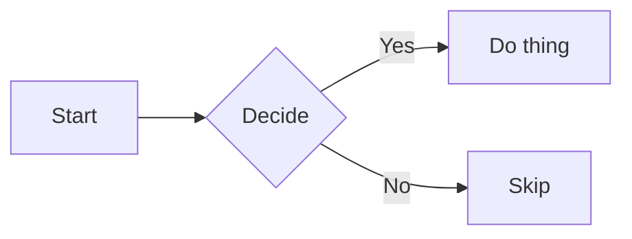

Fenced ` ```mermaid ` blocks render through the bundled `MermaidBlock` component.

## Usage

````md

````

## How it works

The plugin rewrites mermaid fences to a `<div class="np-mermaid" data-graph="…">` placeholder during build. At runtime the `Page` component scans for these placeholders and mounts a Svelte instance of `MermaidBlock` that initializes mermaid lazily.

## Theme

`MermaidBlock` listens to the theme store and re initializes mermaid when the light or dark theme changes, so diagrams match the surrounding page colors.

## Supported diagrams

Anything mermaid supports: flowchart, sequence, class, state, ER, gantt, journey, pie, mindmap. The same renderer handles them all.
